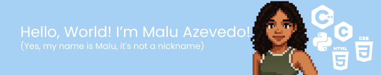

  # Hey! Nice to see you!👋

  
  

  
  I'm currently learning programming and participating in the ***Jovem Talento Tech*** program. I'm focusing on developing my skills in **C++**, **Python** and **HTML/CSS**. I study **competitive programming** to prepare for the **Brazilian Olympiad in Informatics (OBI)**.  

  

  
* 💡  I'm interested about Computer Science, Math, Physics and Linguistics;  
* 🔭  I'm studying at ***Neps Academy***;
* 🗺️  I'm from *Mato Grosso do Sul*, Brazil;
* ⚡  I'm studying electrical technician at the Federal Institute of Mato Grosso do Sul.

  

  
### Programming Languages and technologies

  
  

### Connect With Me

### Stats Malu's Github

  

  
 
 
  <!--
**maaluuzete/maaluuzete** is a ✨ _special_ ✨ repository because its `README.md` (this file) appears on your GitHub profile.

Here are some ideas to get you started:

- 🔭 I’m currently working on ...
- 🌱 I’m currently learning ...
- 👯 I’m looking to collaborate on ...
- 🤔 I’m looking for help with ...
- 💬 Ask me about ...
- 📫 How to reach me: ...
- 😄 Pronouns: ...
- ⚡ Fun fact: ...
--!>

