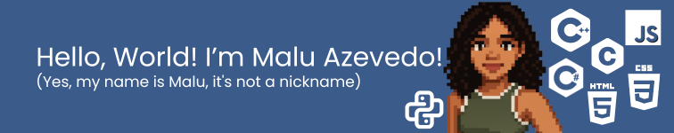

# 🌌 Welcome to my Mission Control 👋  

<div align="center">



[](https://git.io/typing-svg)

</div>

Hi! I’m **Malu Azevedo**, a high school student from **Mato Grosso do Sul, Brazil 🇧🇷**, currently enrolled in a **Technical Course in Electrotechnics** at the Federal Institute of Mato Grosso do Sul (**IFMS**).

I’m part of the **Behring Academy**, developing both technical and soft skills. My core focus lies at the intersection of **Software Engineering and Aerospace**, heavily focused on **Competitive Programming**, **Embedded Systems**, and **Aerodynamics**.

---

### 🛩️ Flight System Initialization

```cpp
class FlightSystem {
public:
    string pilot          = "Malu Azevedo";
    string baseStation    = "MS, Brazil 🇧🇷";
    string currentMission = "Competitive Programming (OBI) & Full Stack Web";
    string avionics       = "Embedded Systems & Aerodynamics";
    string navigation     = "Search Algorithms, LLMs & Reasoning Systems";
    
    void launch() {
        connectHardware();
        calculateAerodynamics();
        executeMission();
    }
};
